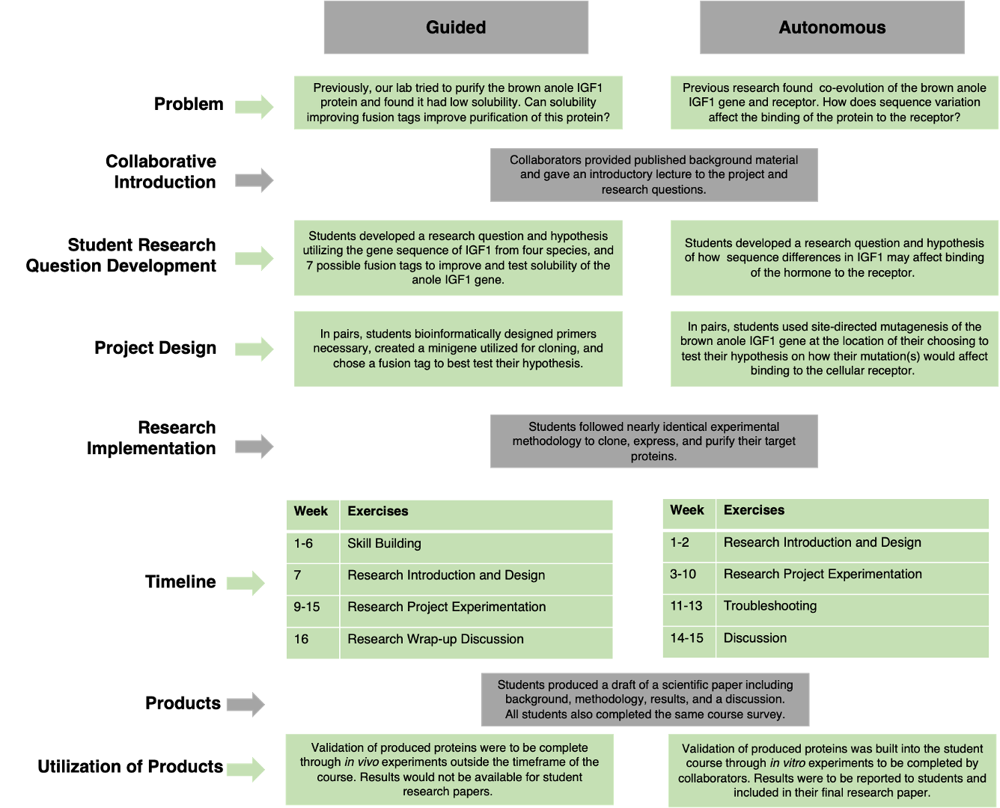

# CURE_SkillBuilding
This repository holds all supplemental files for "Addressing the unique qualities of upper-level biology CUREs through the integration of skill-building ".

Abby E. Beatty, Cissy J. Ballen, Emily P. Driessen, Tonia S. Schwartz & Rita M. Graze

Department of Biological Sciences, Auburn University, Auburn, AL 36849

Corresponding Author: aeb0084@auburn.edu

## Publication Abstract: 
"Early exposure to course-based undergraduate research experiences (CUREs) in introductory biology courses can promote positive student outcomes, but their impacts on students in upper-level courses is less clear. Upper-level courses differ from introductory courses in several ways, and the importance of balancing structure with independence in upper-level CUREs may be essential to their efficacy. Here we analyze and discuss two formats of upper-level biology CUREs (Guided and Autonomous) that vary along a continuum between structure and independence. Reports of student perceptions of confidence, professional applicability, and CURE format indicate that Guided instruction (a more even balance between structure and independence) led to more positive impacts on student outcomes than increased independence. We discuss our results in the context of the unique elements of upper-level relative to lower-level CUREs, focusing on how structured skill-building implementation may affect those elements."

&nbsp;

## Supplemental Figures

**Supplemental Figure 1**: Detailed Research Design. The presented problem, student goals, project implementation and timelines are displayed in both the guided and autonomous frameworks.  Green boxes highlight differences between the two laboratory learning experiences, while gray boxes show similarities.

&nbsp;

## Quick Key to File Directory
File Type | &nbsp;
------------------------------------ | -----------------------------------------------------
Survey Instruments                   | [Information Letter](Information_Letter_2019.docx)
&nbsp;                               | [Pre-Course Survey](Pre_Survey_2019_edit.pdf)
&nbsp;                               | [Post-Course Survey](Post_Survey_2019_edit.pdf)
Raw Data                             | [All Data Excel Workbook](Final.Data.Set.12_2_20.xlsx)
&nbsp;                               | [CSV File for Pre-Post Comparison](Models.csv)
&nbsp;                               | [CSV File for Format Gains Comparison](Gains.data.csv)
Statistics                           | [Statistical Code](ICB_SkillBuilding_CURE.Rmd)
&nbsp;                               | [Statistical Code Output](ICB_SkillBuilding_CURE.html)

## Detailed Explination of Files

A course-based undergraduate research experience (CURE) was completed in two iteractions of an upper-level molecular biology course. In one iteration, students completed a skill-building portion in which students completed lab exercises with known outcomes in order to gain skills necessary for completing an independent reserach project prior to beginning their independent work. In the second iteration, student proceeded with their independent research experience without completing skill-building exercises. Differences and similiarites between iterations can be seen above in **Supplemental Figure 1**.

Prior to participation in the study, students were provided an [information letter](Information_Letter_2019.docx) detailing their role in the reserach. In each iteraction, students were given a [pre-course survey](Pre_Survey_2019_edit.pdf) during the first week of class measuring student confidence and perceived applicabilty of the course to their future careers. Each iteraction then completed a semester-long undergraduate research experience in collaboration with a reserach laboratory on campus, either with or in the absence of a skill-building portion. During the last week of class, students were given a [post-course survey](Post_Survey_2019_edit.pdf) which repeated all questions from the pre-course survey, and asked additional questions on student perceptions of the CURE format they were exposed to.

Following the completion of each course, data was compiled into an [excel file](Final.Data.Set.xlsx) that has worksheets for each implementation, combined implementations, and data sorted by construct (perceptions of applicability, confidence, and CURE format. 
  
Excel Tab| Content
--------------------------- | -----------------------------------------------------
Metadata                 | Worksheet describing survey item abbreviations for analysis and content of worksheets
F2018-Pre                | Data collected from pre-course survey in guided format (2018)
F2018-Post               | Data collected from post-course survey in guided format (2018)
F2019-Pre                | Data collected from pre-course survey in autonomous format (2019)
F2019-Post               | Data collected from post-course survey in autonomous format (2019)
2018 Combined            | Pre-course and post-course data combined from guided format (2018)
2019 Combined            | Pre-course and post-course data combined from autonomous format (2019)
All Data                 | Combination of guided and autonomous format data collection (2018/2019)
18.19 Confidence.App     | Combination of pre/post-course guided and autonomous format data collection (2018/2019) -confidence and applicability measures only
18.19 CURE               | Combination of post-course guided and autonomous format data collection (2018/2019) -perception of CURE measures only
Gains                    | Changs in Pre-Post reports between guided and autonomous format along with pre-course scores for correction

Data was then formatted for statistical analysis in R (version 3.5.1) for pre-post course comparisons as a [CSV file](Models.csv), and course format comparisons as a separate [CSV file](Gains.data.csv). Annotated [statistical code](ICB_SkillBuilding_CURE.Rmd) was written in RMarkdown and results were written to a [HTML file](ICB_SkillBuilding_CURE.html). Download te HTML file for viewing.

